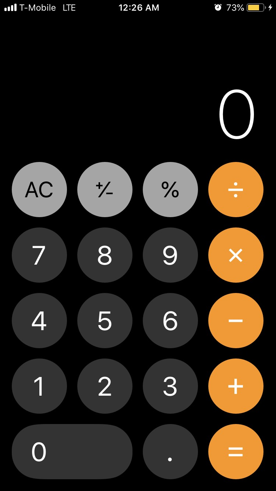

# JavaScript Calculator [Try it out]( https://ericvargas.github.io/calculator/)

## Inspired from iPhone calculator app

### At this moment I have made the four basic math operations and clear button to work. The battery percentage and time are running functions according to the user's device. The next step will be to implement the negative and percent functionality to the calculator.